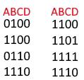
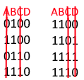

# What is a K-Map?

A Karnaugh Map (K-Map) is a graphical tool used in digital logic design and simplification of Boolean functions. It helps minimize the number of logical operations (AND, OR, NOT) required to implement a given Boolean expression, making circuits more efficient.

### Key Features of a K-Map:
- It visually organizes truth tables of Boolean functions into a grid format.
- Adjacent cells in the grid represent terms that differ by only one variable, allowing easy identification of common factors.
- The aim is to group together adjacent 1s (for SOP minimization) or 0s (for POS minimization) to simplify the Boolean function.
- Groups must be powers of 2 (1, 2, 4), and the larger the group, the more simplified the expression becomes.

### Reading an empty K-Map

The top left of a K-Map displays the variables used and how they relate to the numbers along the grid. The example has 4 variables which makes it a 4x4 grid (3 would be 2x4, 2 would be 2x2). The numbers are counting in Gray Code which is a form of binary which changes only 1 bit at a time when counting.

You use the numbers to plot a truth table onto it. Only the truthy outputs of a truth table are plotted onto a K-Map.
### Reading a filled K-Map

On the left is an ungrouped K-Map. On the right is a grouped K-Map with 2 groups. Groups width/height must be powers of 2 (1, 2, 4). Having fewer and larger groups will result in a more simplified expression. A group can wrap around the edges of a K-Map as shown.

### Converting K-Map to Boolean Algebra

Using the grouped example above, we take the tiles in each group and we line the numbers up vertically. Because we have 2 groups, we will have 2 groups of numbers.

Cross out all the columns where the bits change.

Now take the variables that are not crossed out and if the number below it is a 0 then you have to NOT it.

We are now left with $B\overline{D}+AB$ which is the simplified boolean expression.

https://www.boolean-algebra.com/learn/kmap/
